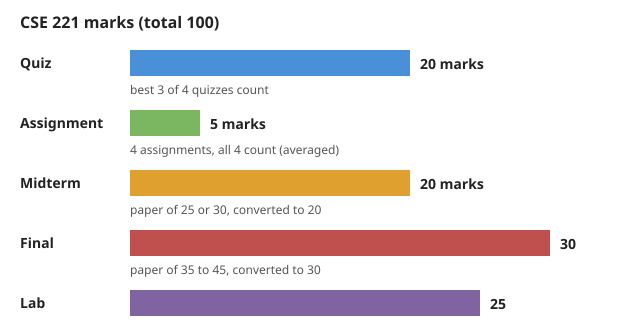

# CSE 221: Algorithms

Instructor: Abdullah Al Mukit (BRAC University lecturer since Spring 2022, has taught 221 for 3 years).
Consultation hours, course resources and the Slack link are to be emailed.

## Marks (out of 100)

| Component | Marks | Rule |
|---|---|---|
| Quiz | 20 | 4 quizzes, best 3 count |
| Assignment | 5 | 4 assignments, all 4 count, averaged |
| Midterm | 20 | paper is 25 or 30 marks, converted to 20 |
| Final | 30 | paper is 35, 40 or 45 marks, converted to 30 |
| Lab | 25 | 100% from lab quizzes, hardest part of the course |

## Quizzes

- Quiz 1: about 2 to 2.5 weeks after Lecture 01, on the easier side
- Quiz 2: about a week before the midterm, challenging on purpose
- Quiz 3: easier
- Quiz 4: before the final, tricky on purpose
- A bonus quiz may be added with Quiz 4 depending on class performance (not guaranteed). Its marks go to the quiz total only, not mid, final or lab.

## Assignments

- 2 before the midterm, 2 between mid and final; submit each before its exam
- Each is released about 1 week before the matching quiz and covers the same syllabus (good practice for the quiz)
- Mostly theory; pseudocode, step-by-step instructions or a flowchart are allowed, but do not mix them in one answer

## Lab

- Marks come entirely from lab quizzes; skipping one means no marks
- Code must run. No partial marks for a few lines of code; marks only for passing test cases
- Evaluation is fully automated and output format is strict (a missing full stop gives zero)
- Lab faculty only lecture, explain problems and run quizzes
- Failing lab can fail the course even with passing theory marks
- Students with coding gaps get 2 to 3 weeks before the first lab quiz; practice a lot

## Theory exams

- Pseudocode, flowchart or runnable code are all accepted unless the question asks for specific code
- Previous semester questions, books, notes and videos will be shared
- Recursion (and memoization) will definitely appear in the midterm; no CSE 220 recap in class

## Attendance and rules

- Aim for 50%+ attendance (official rule is 70%, but 50% is enough to sit the final)
- Barred in lab = retake the course (about Tk 22,500 to 25,000); happens through missed lab attendance or cheating/plagiarism

## Topics covered

### Time complexity / asymptotic analysis (Lecture 02 — covered)

- Best, average and worst case; why time complexity uses the worst case
- Independent vs dependent loops
- Frequency count method and simplification rules
- Time complexity of linear, logarithmic and square-root loops
- Sequential loops (add) and nested loops (multiply)
- Growth order of common complexity classes
- Notation used so far: Big-O only

Related: [INDEX](INDEX.md) | [Formula Sheet](Formula%20Sheet.md)

