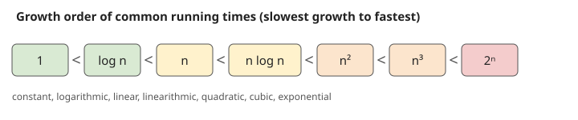

# Formula Sheet (running)

Add to this after every lecture.

## Growth order of running times (Lecture 01)

$$1 < \log n < n < n\log n < n^2 < n^3 < 2^n$$

## Cost measures (Lecture 01)

- Time complexity: how fast the algorithm produces its result (run time)
- Space complexity: how much memory it consumes

Related: [INDEX](INDEX.md) | [Course Overview](Course%20Overview.md)
