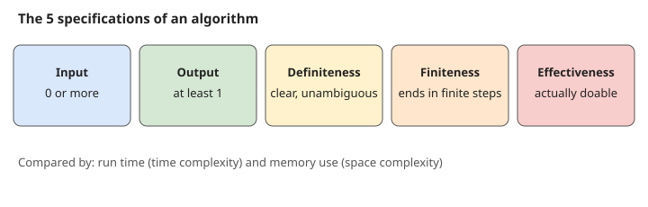
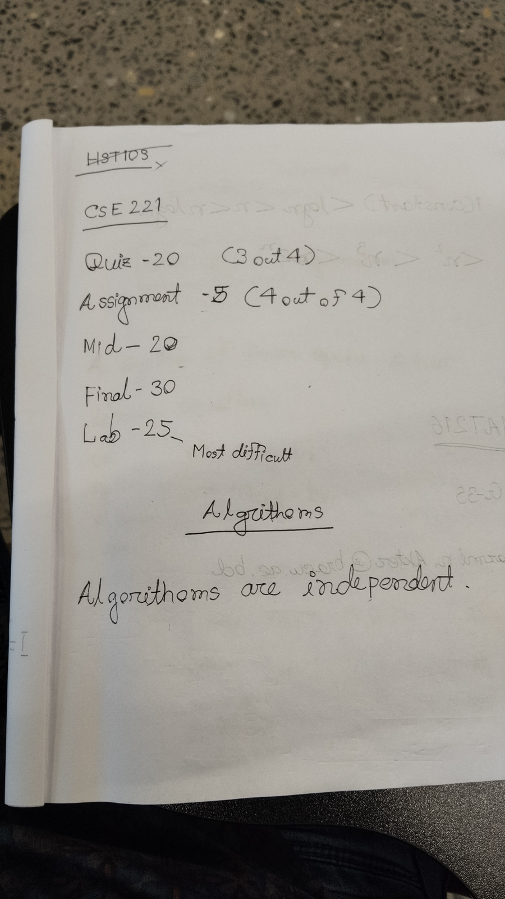
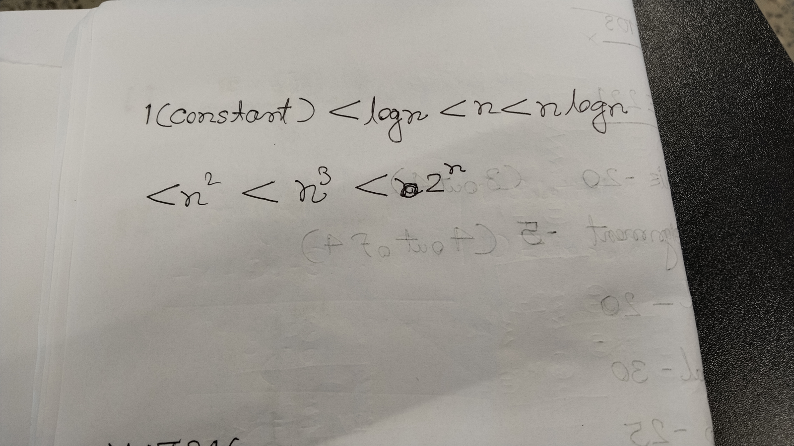

# Lecture 01 - Introduction to Algorithms

> [!abstract] Summary
> Course logistics and marks, what an algorithm is, its 5 specifications, how algorithms are represented, and how they are compared (time vs space).

## 1. Course logistics

Full details are in [Course Overview](../Course%20Overview.md). Key points from the instructor:

- Past semester results don't matter; prepare well for the current one.
- If you took a gap after CSE 220, work extra hard. Theory needs less coding, but the **lab needs serious coding**.
- **Lab (25 marks) is the hardest to score.** Many students reach 70 to 73 out of 75 in theory but miss an A because lab marks are only 8 to 12.

> [!warning] Lab rules
> - Marks come only from lab quizzes; code must run, no partial marks for a few lines.
> - Marks only for passing test cases.
> - Evaluation is fully automated with strict output format. Expected `A B C.` but printed `A B C` (no full stop) gives **zero**.
> - Lab faculty only teach and run quizzes; they don't evaluate.

> [!tip] Mid and final are very scorable
> Solving previous semester questions, staying serious in class and thinking it through makes about 45 out of 50 in mid + final realistic.

### Theory answers: code, flowchart or pseudocode

- Unless a question asks for specific code, you can answer with runnable code, a **flowchart** or **pseudocode**.
- **Pseudocode** = close to real code but not exactly runnable. Anyone who knows any programming language can read it and convert it to their language. It won't run directly on a compiler.
- Don't mix styles in one answer (a line of code, then a flowchart, then instructions).
- Assignments are usually theory based, not direct code.

### Prerequisites

- No recap of CSE 220. Start directly with 221 topics.
- Keep **recursion** and **memoization** fresh; recursion will definitely be in the midterm.
- Class format: one class theory, next class practice problems.
- Why CSE 110 to 221 in sequence: to grow problem-solving, analytical ability and critical thinking, not just to learn languages.

### Attendance

Aim for 50%+ (official 70%). Poor attendance means missed topics and no borderline help. Never get barred in lab (missed attendance or cheating/plagiarism); retake costs about Tk 22,500 to 25,000.

## 2. What is an algorithm?

> [!note] Simple definition
> An algorithm is a set of steps or instructions to do something or achieve a specific task.

Example: making plain (red) tea.

1. Take water in a pot
2. Boil the water and add tea leaves
3. Strain into a cup
4. Add sugar or lemon

Familiar algorithms from CSE 220: Bubble, Selection, Insertion and Count sort.

- Selection sort: find the min (or max) element, compare with the rest, swap
- Bubble sort: compare adjacent pairs and swap

> [!note] Formal definition
> A finite set of statements that guarantees an optimal solution in a finite interval of time.

Random steps are not automatically an algorithm; it must meet the specifications below.

## 3. Specifications (characteristics)

1. **Input**: zero or more inputs.
2. **Output**: at least one output. No output or result means it is not an algorithm.
3. **Definiteness**: every statement is clear, precise and unambiguous (no double meaning).
   - "Take any liquid and boil it" is ambiguous (could be oil or honey). Say water.
4. **Finiteness**: must end in a limited amount of time with finitely many steps. Infinite time to get a result means not an algorithm.
5. **Effectiveness**: every instruction must be executable with current technology and resources.
   - "Take nuclear fuel and boil it" is not doable under normal conditions.

## 4. Representation

An algorithm is **language independent**: it doesn't depend on any specific programming language. It can be written as:

- Flowchart
- Pseudocode
- Step-by-step plain instructions

## 5. Comparing algorithms

Two factors decide how good an algorithm is:

1. **Run time** (time complexity): how fast it gives the result
2. **Memory consumption** (space complexity): how much memory it uses

### Growth order (from handwritten notes)

$$1 < \log n < n < n\log n < n^2 < n^3 < 2^n$$

## Handwritten notes

## Open items

- The transcript cuts off partway through the time vs space complexity part. The growth order above comes only from the photo; add anything the teacher said about it once you have the rest.
- Lecture date is assumed to be 2026-10-05. Rename the file and update the frontmatter and INDEX if it's different.

Related: [INDEX](../INDEX.md) | [Course Overview](../Course%20Overview.md) | [Formula Sheet](../Formula%20Sheet.md)
