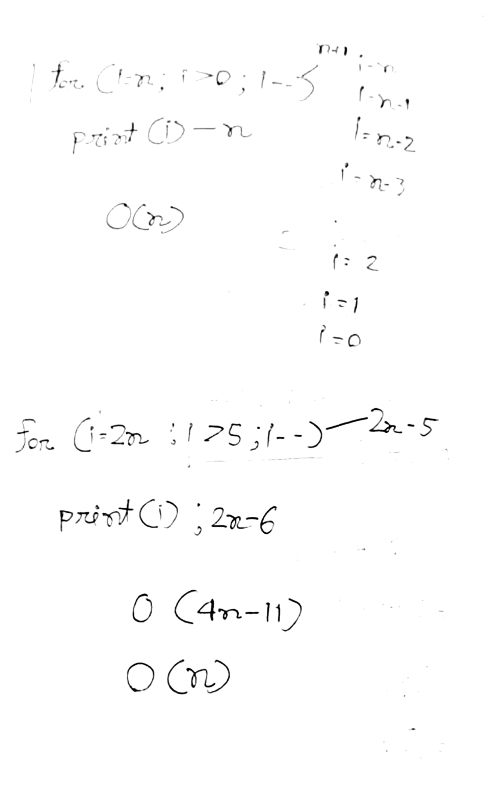
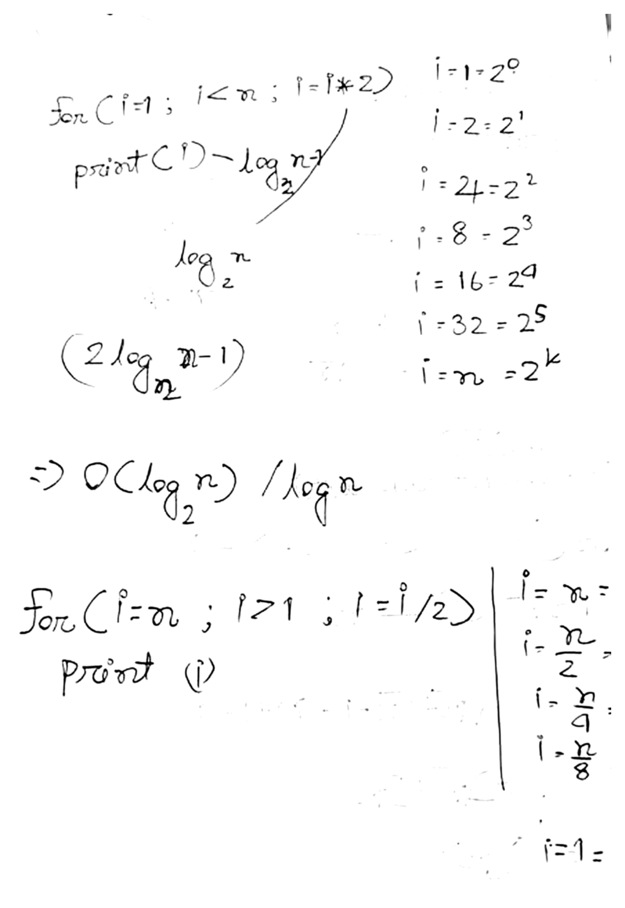
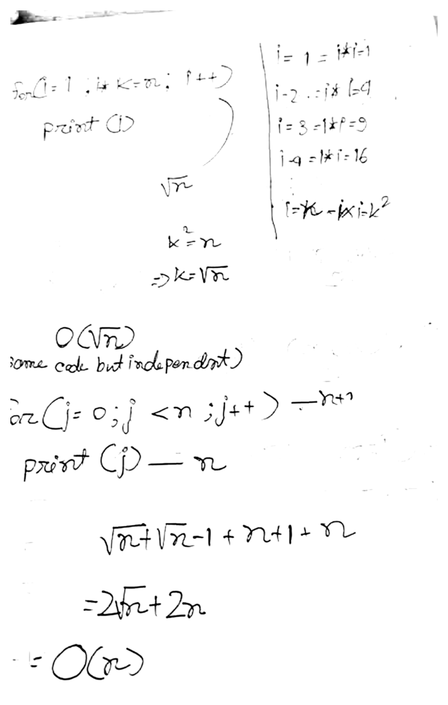
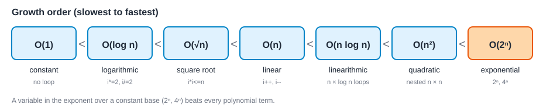
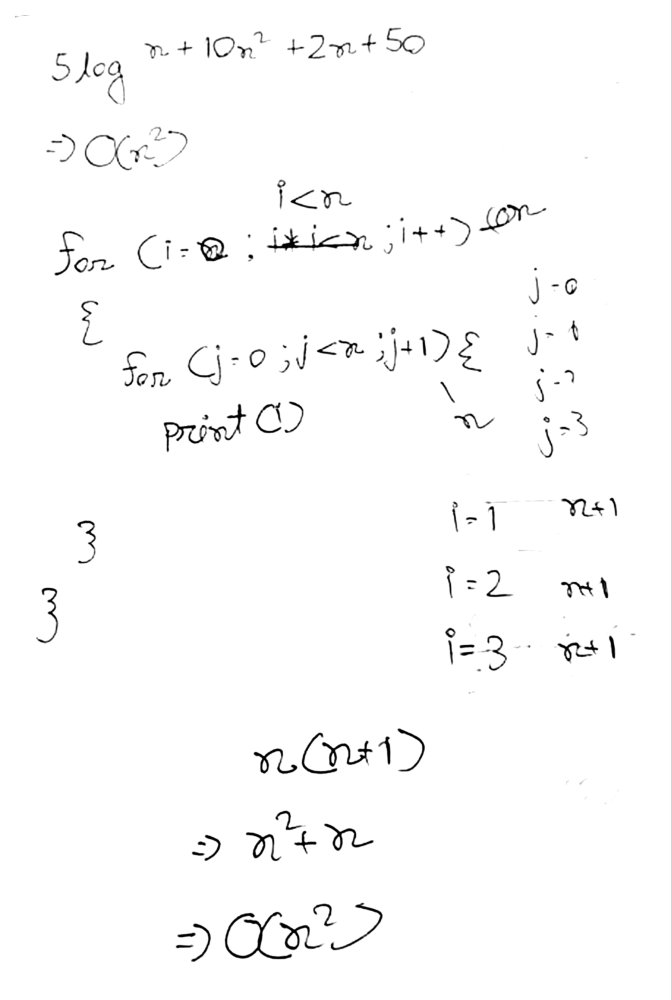
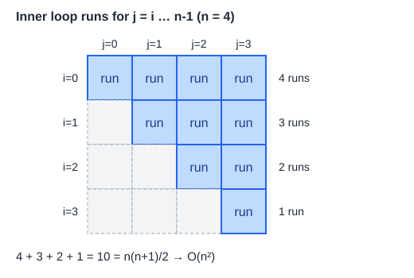
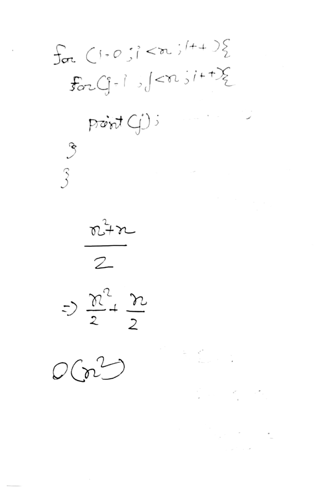

# Lecture 02 - Time Complexity of Loops

> [!warning] The first ~10 minutes of this lecture are missing
> The recording (and both transcripts) start mid-way through the linear-search average-case example. Anything the instructor said before that is not in these notes.

> [!summary] Key takeaways
> - Time complexity is analysed for the **worst case**. The average case is usually close to it, and the best case is rare.
> - **Frequency count method:** count how many times each line runs, add the counts, then keep only the highest-growth term and drop constants.
> - Loop patterns: `i++` / `i--` gives $O(n)$; `i *= 2` / `i /= 2` gives $O(\log n)$; `i * i <= n` gives $O(\sqrt{n})$.
> - **Sequential** loops add (the larger one wins). **Nested** loops multiply.
> - Growth order: $1 < \log n < \sqrt{n} < n < n\log n < n^2 < 2^n$.

---

## 1. Best, average and worst case

Every algorithm has a best case, an average case and a worst case.

- **Linear search:** the best case is the target sitting at index 0. That happens rarely (roughly 5-10% of searches or less), so most runs fall into the average or worst case.
- As the input size grows (say $n = 100$), the worst case goes from a handful of comparisons to about 100, but the best case stays at 1 or 2 comparisons. The best case says almost nothing about how the algorithm scales.
- So when we talk about **time complexity** (running time compared to input size) we always use the **worst case**: it tells you the most you can ever be made to pay.
- The **average case** is almost always close to the worst case (examples come later in the course).

> [!example] Which algorithm would you pick?
> Both algorithms solve the same problem.
>
> | | Worst case | Best case |
> |---|---|---|
> | Algorithm A | 15 s | 5 s |
> | Algorithm B | 30 s | 2 s |
>
> Pick **A**. B only wins in a few rare best-case situations, while A is better on average and in the worst case. Always give priority to the worst case.

**Linear search:** in the worst case it makes $n$ comparisons, so its time complexity is $O(n)$.

## 2. Independent vs dependent loops

- **Independent loop:** does not depend on any other loop. A single loop, or loops placed one after another, are independent.
- **Dependent loop:** the inner loop of a nested loop. How many times it runs depends on the outer loop.

## 3. Frequency count method

Count how many times each line runs.

```c
for (i = 0; i < n; i++)
    print(i);
```

- The `for` line runs $n + 1$ times. The last check fails: for $n = 6$, $i = 0, 1, \dots, 6$ gives 7 checks.
- `print(i)` runs $n$ times, once for each $i < n$.
- Total:

$$(n + 1) + n = 2n + 1$$

> [!tip] Simplification rules
> 1. Drop constant terms (the $+1$).
> 2. Keep only the highest-growth term and drop the lower ones.
> 3. Drop constant factors (the $2$ in $2n$).
>
> $2n + 1 \Rightarrow O(n)$

If the condition were `i <= n`, the body would run $n + 1$ times and the header $n + 2$ times, and the complexity is still $O(n)$.

> [!note] In the exam
> You do not need to write all of this out. Section 9 has the shortcut.

## 4. Linear loops

### 4.1 Decrementing loop

```c
for (i = n; i > 0; i--)
    print(i);
```

$i$ takes the values $n, n-1, n-2, \dots, 2, 1, 0$. The header runs $n + 1$ times and the body $n$ times (the body is skipped once $i = 0$).

$$(n + 1) + n = 2n + 1 \;\Rightarrow\; O(n)$$

### 4.2 Scaled bounds

```c
for (i = 2*n; i > 5; i--)
    print(i);
```

As counted in class, the header runs $2n - 5$ times and the body $2n - 6$ times:

$$(2n - 5) + (2n - 6) = 4n - 11 \;\Rightarrow\; O(n)$$

The $-11$ is a constant and the $4$ is a constant factor, so both are dropped.

> [!note] Exact count (my check, not from class)
> The body runs for $i = 2n, 2n-1, \dots, 6$, which is $2n - 5$ times, and the header runs $2n - 4$ times. That gives $4n - 9$ instead of $4n - 11$. Off-by-one differences never change the Big-O, so the answer is $O(n)$ either way.



## 5. Logarithmic loops

### 5.1 Multiplying by 2

```c
for (i = 1; i < n; i = i * 2)
    print(i);
```

| iteration | 1 | 2 | 3 | 4 | 5 | 6 | ... | $k$ |
|---|---|---|---|---|---|---|---|---|
| $i$ | 1 | 2 | 4 | 8 | 16 | 32 | ... | $2^{k}$ |
| as a power | $2^0$ | $2^1$ | $2^2$ | $2^3$ | $2^4$ | $2^5$ | ... | $2^{k}$ |

Suppose the loop stops after $k$ steps, when $i$ reaches $n$:

$$2^k = n \;\Rightarrow\; k = \log_2 n$$

The header runs about $\log_2 n$ times and the body one time fewer:

$$\log_2 n + (\log_2 n - 1) = 2\log_2 n - 1 \;\Rightarrow\; O(\log n)$$

### 5.2 Multiplying by 3

Now $i = 1, 3, 9, 27, 81, \dots = 3^0, 3^1, 3^2, 3^3, \dots$ and the loop stops when

$$3^k = n \;\Rightarrow\; k = \log_3 n$$

> [!tip] The base of a logarithm
> For a logarithmic answer you can drop the base: $\log_3 n$ and $\log n$ are both accepted. Writing the **wrong** base (for example $\log_4 n$) is marked wrong, so the safest choice is to write just $O(\log n)$.

### 5.3 Dividing by 2

```c
for (i = n; i > 1; i = i / 2)
    print(i);
```

$i = \dfrac{n}{2^0}, \dfrac{n}{2^1}, \dfrac{n}{2^2}, \dfrac{n}{2^3}, \dots$ and the loop stops when $i = 1$:

$$\frac{n}{2^k} = 1 \;\Rightarrow\; 2^k = n \;\Rightarrow\; k = \log_2 n \;\Rightarrow\; O(\log n)$$

Dividing by 3 gives $\log_3 n$ and dividing by 9 gives $\log_9 n$. Every case is still logarithmic, $O(\log n)$.



## 6. Square-root loop

```c
for (i = 1; i * i <= n; i++)
    print(i);
```

The condition tests $i \times i$, so the values being compared against $n$ are $1, 4, 9, 16, \dots$. After $k$ steps the condition fails when $k^2 = n$:

$$k^2 = n \;\Rightarrow\; k = \sqrt{n} \;\Rightarrow\; O(\sqrt{n})$$

This is **not** $O(n\log n)$ and not $O(\log n)$.

> [!question] Can the root be dropped?
> No. $\sqrt{n} = n^{1/2}$ is a power of $n$, and powers are never dropped. You only drop constant **factors** and **lower-order terms**.

## 7. Sequential (independent) loops

```c
for (i = 1; i * i <= n; i++)    // runs about sqrt(n) times
    print(i);

for (j = 0; j < n; j++)         // independent loop, one after the other
    print(j);
```

Add the counts of every line:

$$\sqrt{n} + (\sqrt{n} - 1) + (n + 1) + n = 2\sqrt{n} + 2n$$

The highest term is $n$ (power 1, versus $\tfrac{1}{2}$ for $\sqrt{n}$). Drop the lower term and the factor 2:

$$2\sqrt{n} + 2n \;\Rightarrow\; O(n)$$



## 8. Comparing growth rates

From slowest to fastest:

$$O(1) < O(\log n) < O(\sqrt{n}) < O(n) < O(n\log n) < O(n^2) < O(2^n)$$



| Class | Name |
|---|---|
| $O(1)$ | constant (no growth) |
| $O(\log n)$ | logarithmic |
| $O(n)$ | linear |
| $O(n\log n)$ | linearithmic |
| $O(n^2)$ | quadratic |
| $O(2^n)$, $O(4^n)$ | exponential |

> [!tip] Spotting exponential
> A **variable in the exponent** over a constant base ($2^n$, $4^n$) is exponential and beats every polynomial term.

**Simplifying a function:**

$$5n\log n + 10n^2 + 2n + 50 \;\Rightarrow\; O(n^2)$$

Drop the constant $50$, drop the smaller terms $n\log n$ and $n$, and drop the factor $10$.

If a term $4^n$ is added, it is the largest term and the answer becomes $O(4^n)$. Do **not** drop the base here: $4^n$ is not the same as $2^n$.



## 9. Exam shortcut

You do not have to count every $+1$ and $-1$. Write the Big-O of each loop directly and combine them:

- Loops one after another: **add**, so the larger one wins.
- Nested loops: **multiply**.

Example: a $\sqrt{n}$ loop followed by an independent $n$ loop. The first is $O(\sqrt{n})$ and the second is $O(n)$, and $n$ is bigger, so the answer is $O(n)$. When writing the final answer, always write it as $O(\dots)$.

## 10. Nested loops

### 10.1 Independent bounds

```c
for (i = 0; i < n; i++) {
    for (j = 0; j < n; j++) {
        print(j);
    }
}
```

For each value of $i$ the inner `for` line runs $n + 1$ times ($j = 0, 1, \dots, n$), and there are $n$ values of $i$:

$$n(n + 1) = n^2 + n \;\Rightarrow\; O(n^2)$$

> [!tip] Shortcut
> Treat the inner loop as if it were independent: it is $O(n)$. Multiply by the number of times the outer loop runs, which is $n$. Result: $n \times n = O(n^2)$. For nested loops, **multiply**.

### 10.2 Inner loop starting at `j = i`

```c
for (i = 0; i < n; i++) {
    for (j = i; j < n; j++) {
        print(j);
    }
}
```

The inner loop now shrinks as $i$ grows: it runs $n$ times for $i = 0$, $n - 1$ times for $i = 1$, and so on down to 1 time.

$$n + (n-1) + \dots + 2 + 1 = \frac{n(n + 1)}{2} = \frac{n^2}{2} + \frac{n}{2} \;\Rightarrow\; O(n^2)$$

The $\tfrac{1}{2}$ is a constant factor and $\tfrac{n}{2}$ is a lower term, so both go away.



> [!note] How it was shown in class
> Using $n = 4$ and counting the failing header checks too, the inner line runs 2, 3, 4, 5, ... times, which is a number series. Pulling out the extra $+1$ leaves $1 + 2 + \dots + n$, and the formula $\dfrac{n(n+1)}{2}$ gives the total. It is still a multiplication of inner and outer, but because $j$ starts at $i$ you get that factor of $\tfrac{1}{2}$.



## 11. More variations

There can be many more combinations. All of them have to be practised.

- Outer loop $O(n)$ with an inner loop that runs $O(\log n)$ times (even though the inner one starts from $i$): multiply, so $O(n\log n)$.
- Outer loop $O(\log n)$ with an inner loop of $O(\sqrt{n})$: multiply, so $O(\sqrt{n}\,\log n)$.

> [!question] Student question
> A function contains both a $\sqrt{n}\,\log n$ term and an $n$ term. Which one counts?
>
> The $n$ term. $n$ grows faster than $\sqrt{n}\,\log n$, so the answer is just $O(n)$.

---

> [!bug] Open items to verify
> - The first ~10 minutes of the lecture are not covered (see the note at the top).
> - Photo 1: the exact count for `i = 2n; i > 5` is $4n - 9$, not $4n - 11$. The Big-O does not change.
> - Photo 2: the inner loop is written with `i++`. It should be `j++`.
> - Photo 4: the loop condition looks like `i * k`. It was treated as `i * i <= n`.
> - Photo 5: the first term reads like $5 \log n$. The transcript says $5n\log n$. The answer is $O(n^2)$ either way.
> - The code for the two last variations (section 11) was drawn on the board and is not in any photo, so the loop headers are my reconstruction from what the instructor said.

Related: [Lecture 01 - Introduction to Algorithms](2026-10-05%20Lecture%2001%20-%20Introduction%20to%20Algorithms.md) · [Formula Sheet](../Formula%20Sheet.md) · [Course Overview](../Course%20Overview.md) · [INDEX](../INDEX.md)
